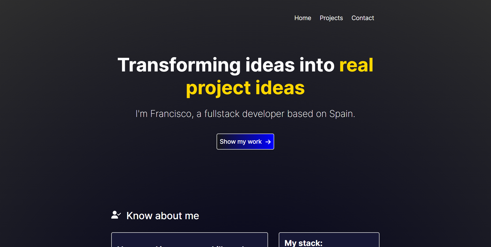
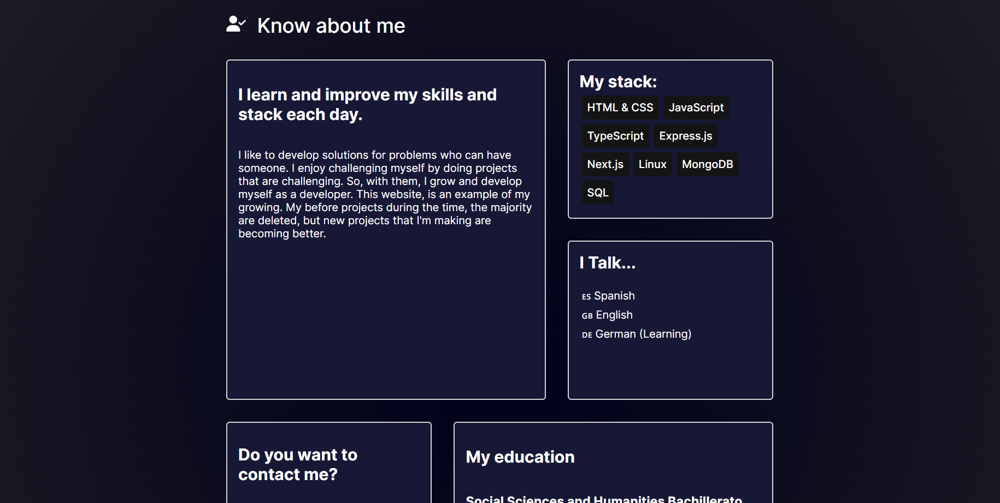
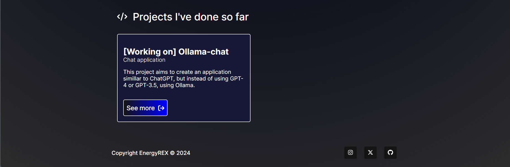

# EnergyREX's Portfolio

## Description

This is a personal portfolio to showcase projects, built with Next.js and CSS Modules. This website features Hero, About, Projects, and Contact sections.
(I'm building this website!)

This website is now deployed on Vercel's site since it uses **Next.js**

## Built with: 

- [Next.js](nextjs.org)
- [CSS Modules](https://nextjs.org/docs/app/building-your-application/styling/css-modules)
- [React Icons](https://react-icons.github.io/react-icons/)
- [GSAP](https://gsap.com/)

## Visit website

https://energyrex.dev

## Todos

- Sections decorations and effects.
- Give more identity to the cards of About Me section.
- Add more projects and give their cards their own style and separated page.
- Create a error 404 section.
- Responsive design **(DONE)**
- Animate the website **(DONE)**

## Run the project

1. Open **Powershell** or your prefered terminal emulator.

2. Clone the repo with ```git clone https://github.com/energyrex/portfolio```

3. Go to the directory of the portfolio, in this case you should use ```cd portfolio```

4. Run ``` npm run dev ``` in terminal. You should check if you are in the correspondant directory. You should have Node and Npm installed.

5. Go to ``` localhost:3000 ```

## Why Next.js?

There are some main reasons. 

- 1st, It's a React.js framework with all things I would need to make a project.
- 2nd, Since It's a framework, it includes many optimizations who I could not make it with React.

In summary, I will use Next to build this portfolio because of its advantages and because is a nice opportunity to learn this framework
Also, I know there are other very good options to make projects like this, such as Astro.build, but this time I will use Next.

## Project images







You can use this project for your own portfolio. Just, give the credits that I've made this project.